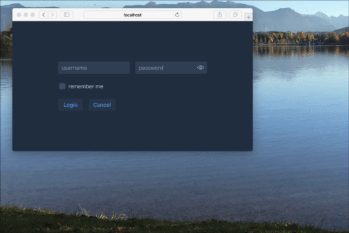

<center>
<a href="https://vaadin.com">
 </a>
</center>


>IMPORTAND This component is replaced to
>[https://github.com/vaadin-developer/vaadin-components](https://github.com/vaadin-developer/vaadin-components)


# RapidPM Vaadin Component - Login
A simple Login Screen - boring but usefull ;-)
This is for Vaadin 10, build on a JDK10 but with 

```xml
    <maven.compiler.target>1.8</maven.compiler.target>
    <maven.compiler.source>1.8</maven.compiler.source>
```

## Why?
A Login Screen is often used, and a repetive task to create if you are 
creating smaller apps, demos, and so on.

For this I created the component, da work with dependencies instead of copy-paste. even in my examples.

## How it looks like ?



## How?
You can use this as a dependency. The only thing you have to do 
is to create the the connection to your app.

### Step 1 - connect to your Auth - Service
The first method to create is the  method with the name 
```public abstract boolean checkCredentials();```

Here you have to decide if the provided credentials are valid or not.
In the demo/test Source folder you will find the class **MyLoginView**
The implementation in this class is for demo usage only.

```java
  @Override
  public boolean checkCredentials() {
    String username = username();
    String password = password();

    // USE Apache Shiro for example : demo you can find here
    // https://github.com/Nano-Vaadin-Demos/nano-vaadin-meecrowave-shiro-V10

    // DON NOT USE THIS IN PRODUCTION !!
    boolean isOK = username != null && username.equals("admin") ||
                   password != null && password.equals("admin");

    UI.getCurrent().getSession().setAttribute(LOGGED_IN, isOK);
    // DON NOT USE THIS IN PRODUCTION !!

    return isOK;
  }
```

### Step 2 - what to do if auth failed
Define what should happen if the Auth-Service will reject the provided credentials.
In this example there will be a Notification shown and a logger message created.

```java
  @Override
  public void reactOnFailedLogin() {
    logger().warning("Login is not acctepd..");
    Notification.show("Credentials not accepted..");
  }
```
### Step 3 - what to do if auth is OK
Now we can redirect to the next View.
In this example a demo view with no special meaning.

```java
  @Override
  public void navigateToApp() {
    UI.getCurrent().navigate(MainView.class);
  }
```

## Demo Usage
In the test folders you will find a fully working demo app to show 
a dummy implementation. If you want to see samo more examples, for example how to use this with Shiro,
have a look at 
[https://github.com/Nano-Vaadin-Demos/nano-vaadin-meecrowave-shiro-V10](https://github.com/Nano-Vaadin-Demos/nano-vaadin-meecrowave-shiro-V10)

## ROADMAP
* I18n will be added
* TDD / PageObjects based on Testbench NG and jUnit5


## How to connect?
Feel free to ping me .. 
* email  sven.ruppert (a) gmail.com
* Twitter - @SvenRuppert


